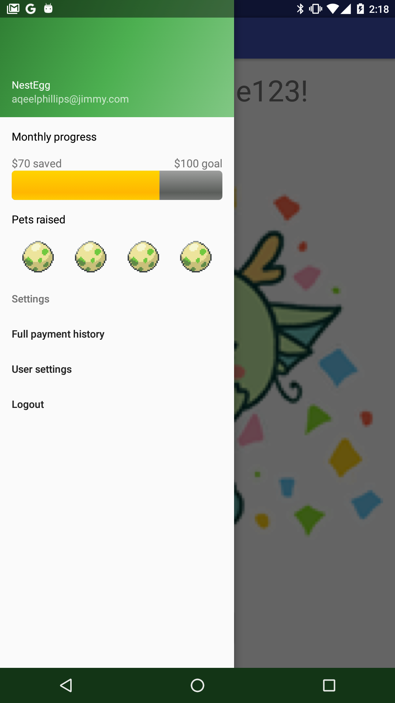
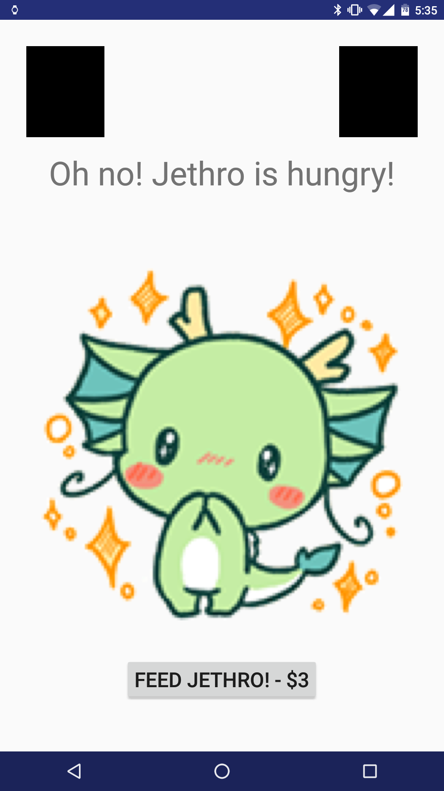
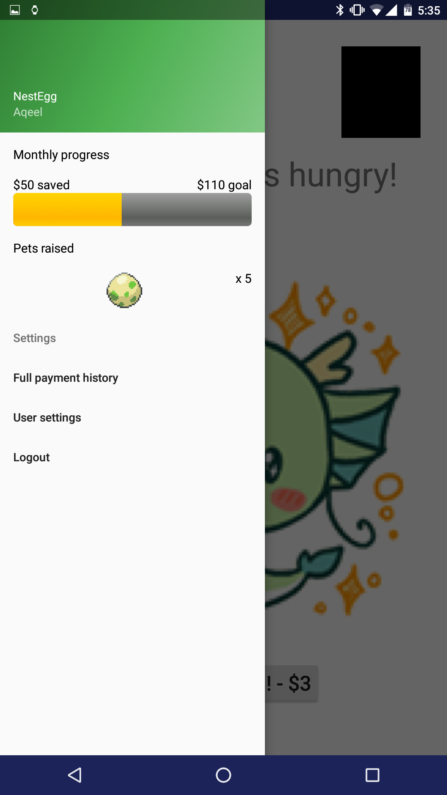

# NestEgg: Android Application

## Progress to date:

### 3/28/16 (Aqeel):
* Created a skeletal main activity and created potential formatting based on initial design.
* Demo goals: show pet with all possible states, create (non-functional) menus and welcome screens.
* Screenshots

### 3/29/16 (Aqeel):
* Created introductory sequence of account creation screens, leading to Main Activity.
* Account creation screenshots:

* Able to cycle through preliminary pet states for the purposes of our prototype.
* Pet state screenshots:

* Mini-dashboard incorporated in the slide-out settings menu

### 4/3/16 (Aqeel):
* Created simple internal plumbing in the application (passing values from activity to activity without hard coding). Began work on implementing design paradigms.

### 4/7/16 (Aqeel):
* Made custom font system-wide
 
### 4/12/16 (Aqeel):
* Refactored application to move away from prototype and towards functional app
* Cleaned up codebase and restructured messy methods
* Determined locations of API calls and filled with temporary data to test functionality

### 4/14/16 (Juliana):
* finally updated this folder
* modified layout for activity_enter_bank_info.xml, still need to fix bottom button

### 4/18/16 (Aqeel):
* Created basic classes to issue get/post requests

### 4/19/16 (Juliana):
* modified layouts for all layout screens
* added drawable-nodpi
