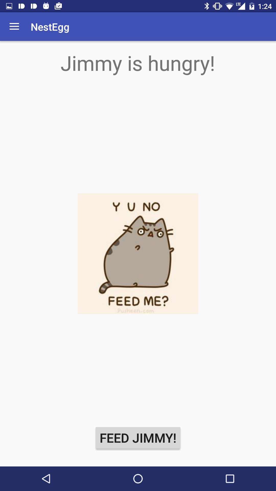

# NestEgg: Android Application

## Progress to date:

### 3/28/16 (Aqeel):
* Created a skeletal main activity and created potential formatting based on initial design.
* Demo goals: show pet with all possible states, create (non-functional) menus and welcome screens.

Screenshots:

