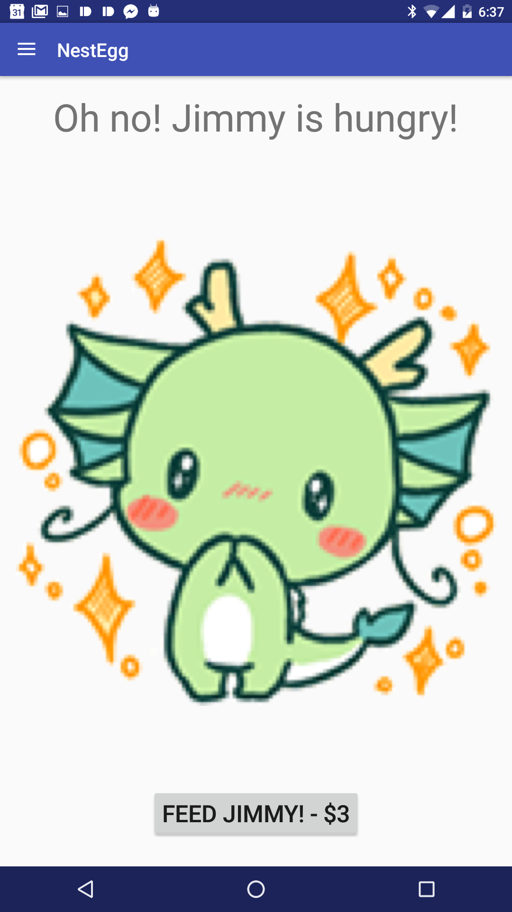

# NestEgg: Android Application

## Progress to date:

### 3/28/16 (Aqeel):
* Created a skeletal main activity and created potential formatting based on initial design.
* Demo goals: show pet with all possible states, create (non-functional) menus and welcome screens.
* Screenshots

### 3/29/16 (Aqeel):
* Created introductory sequence of account creation screens, leading to Main Activity.
* Account creation screenshots:

* Able to cycle through preliminary pet states for the purposes of our prototype.
* Pet state screenshots:

